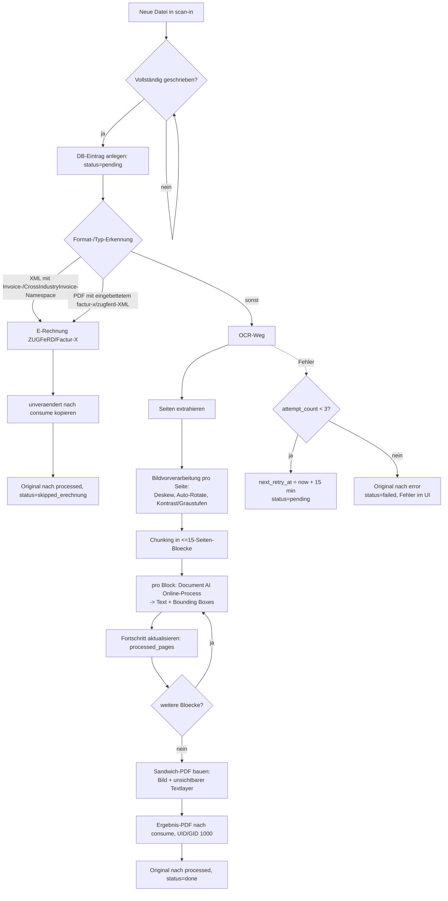

# Product Requirements Document (PRD) — Lector

> **Stand:** Juni 2026
> **Kontext:** Privates Projekt (kein Bezug zum Jacques'-/WRS-Tech-Stack erforderlich)
> **Zweck:** Direkte Verwendung als Kontext für die Entwicklung mit Claude Code

---

## 1. Projektzusammenfassung

- **Projektname:** Lector
- **Projekttyp:** Lokaler Backend-Service mit minimalem Web-UI, als zusätzlicher Docker-Container im bestehenden Paperless-ngx-Compose-Stack
- **Kurzbeschreibung:** Lector überwacht einen Eingangsordner, veredelt eingehende Dokumente (Bilder, PDF, TIFF) per Cloud-OCR zu durchsuchbaren „Sandwich"-PDFs und legt sie für den automatischen Import in Paperless-ngx ab. E-Rechnungen werden erkannt und unverändert durchgereicht.

---

## 2. Problemstellung & Zielgruppe

- **Problem:** Die in Paperless-ngx eingebaute OCR (Tesseract via OCRmyPDF) stößt bei schwierigen Vorlagen (schlechte Scans, Fotos, gemischte Formate) an Qualitätsgrenzen. Eine bessere, dokumentenzentrierte Cloud-OCR liefert deutlich saubereren, durchsuchbaren Text.
- **Zielgruppe:** Privates NAS-Setup (Zettlab/ZettOS) mit Paperless-ngx. Betrieb ausschließlich im lokalen Netzwerk (LAN), Einzelnutzer.
- **Alleinstellungsmerkmal:** Lector ist ein schlanker Veredelungsschritt, der sich **vor** Paperless schiebt, statt es zu ersetzen. Er kümmert sich ausschließlich um exzellente Texterkennung und Bildaufbereitung; die inhaltliche Verarbeitung (Klassifizierung, Tags, Korrespondenten) bleibt vollständig bei Paperless. Die OCR-Engine ist über ein Adapter-Interface austauschbar.

---

## 3. Funktionsumfang

### 3.1 MVP (Must-have)

- [ ] **Watch-Folder-Überwachung** — Beobachtung des Eingangsordners (`scan-in`); neue Dateien werden automatisch erkannt und in die Verarbeitungs-Queue aufgenommen.
- [ ] **Format-Erkennung & Routing** — Unterstützte Eingangsformate: PDF, TIFF, JPG/JPEG, PNG (weitere Bildformate optional). Bestimmung des Verarbeitungswegs (OCR vs. E-Rechnungs-Bypass).
- [ ] **E-Rechnungs-Bypass (deterministisch)** — Erkennung von XRechnung (reines XML) und ZUGFeRD/Factur-X (PDF/A-3 mit eingebettetem XML). Erkannte E-Rechnungen werden **unverändert** nach `consume` durchgereicht (keine OCR, keine PDF-Modifikation). Status `skipped_erechnung` ausschließlich in Historie/UI — **keine** Umbenennung, **keine** Paperless-Tags.
- [ ] **Bildvorverarbeitung** — Pro Seite vor der OCR: Deskew (Schieflagenkorrektur), Auto-Rotate (Orientierungserkennung), leichte Kontrast-/Graustufen-Optimierung.
- [ ] **OCR via austauschbarem Adapter** — MVP fest mit Google Document AI (Enterprise Document OCR, Region `eu`). Implementierung hinter einem Adapter-Interface, das spätere Engines (Cloud Vision, AWS Textract) erlaubt.
- [ ] **Chunking großer Dokumente** — Dokumente werden lokal in Blöcke von ≤ 15 Seiten zerlegt (Online-Limit der Document-AI-Engine), blockweise verarbeitet und anschließend wieder zu **einem** Gesamt-PDF zusammengeführt. Kein Google-Cloud-Storage-Roundtrip nötig.
- [ ] **Durchsuchbares Sandwich-PDF** — Erzeugung eines PDFs mit dem (vorverarbeiteten) Originalbild als sichtbare Ebene und einem unsichtbaren, durchsuchbaren Textlayer auf Basis der von der OCR gelieferten Token-/Bounding-Box-Daten.
- [ ] **Ablage nach `consume`** — Fertiges PDF wird in den geteilten Paperless-Consume-Ordner geschrieben, mit korrekter Eigentümerschaft (UID/GID 1000).
- [ ] **SQLite-Historie** — Persistente Verarbeitungs-Historie (Tabelle `documents`) inkl. Live-Fortschritt, Versuchszähler und Zeitstempeln; zusätzlich Verlaufs-Log (Tabelle `document_events`).
- [ ] **Web-UI (ohne Auth)** — Dashboard mit Status-Kacheln, filterbare Historientabelle, Detailansicht je Dokument mit Live-Fortschritt und Verlaufs-Log. Live-Updates via Server-Sent Events.
- [ ] **Datei-Lifecycle** — Eingang → bei Erfolg Original nach `processed` (automatische Löschung nach 30 Tagen) → bei endgültigem Fehler Original nach `error` (bleibt dauerhaft liegen). Ergebnis-PDF stets nach `consume`.
- [ ] **Auto-Retry** — Bei Fehler automatischer erneuter Versuch nach 15 Minuten, maximal 3 Versuche. Danach Status `failed`, Verschiebung nach `error`, Anzeige des Fehlers im UI. **Kein** manueller Retry-Button.
- [ ] **Retention-Job** — Tägliche, automatische Löschung von Dateien im `processed`-Ordner, die älter als 30 Tage sind. DB-Einträge bleiben für die Historie erhalten.
- [ ] **Konfiguration via ENV** — Sämtliche Einstellungen (GCP-Projekt, Processor, Region, Credentials-Pfad, Ordnerpfade, Retry-/Retention-Parameter, Vorverarbeitungs-Flags) über Umgebungsvariablen.

### 3.2 Nice-to-have (später)

- [ ] Aktive Implementierung weiterer OCR-Adapter (Google Cloud Vision, AWS Textract).
- [ ] Confidence-Score-Auswertung mit Qualitätswarnung im UI bei niedriger Erkennungssicherheit.

### 3.3 Explizit ausgeschlossen

- Keine Authentifizierung (Betrieb ausschließlich im LAN).
- Keine inhaltliche Datenextraktion, Klassifizierung, Verschlagwortung oder Korrespondenten-Logik — das ist Aufgabe von Paperless-ngx.
- Kein manueller Datei-Upload über das Web-UI.
- Kein eigenes Scannen / keine Scanner-Anbindung.
- Keine Cloud-Anbindung außer der reinen OCR-Engine.

---

## 4. Technische Architektur

### 4.1 Übersicht

- **Architekturstil:** Eigenständiger, lokaler Einzweck-Service. Ein Container, ein Prozess: FastAPI/uvicorn bedient Web-UI und interne API; ein asynchroner Hintergrund-Worker (asyncio-Task) überwacht den Watch-Folder und arbeitet die Queue seriell ab. CPU-lastige Schritte (OpenCV-Vorverarbeitung, PDF-Bau) laufen in einem Thread-/Process-Pool, damit das UI responsiv bleibt; die Document-AI-Aufrufe sind netzwerk-I/O-gebunden.
- **Authentifizierung:** keine (nur LAN).
- **Integration:** Lector wird als zusätzlicher Service in das bestehende Paperless-ngx-Compose aufgenommen und teilt sich den `consume`-Ordner mit Paperless.
- **Wichtige Paperless-Vorgabe:** In der Paperless-Konfiguration ist `PAPERLESS_OCR_MODE: skip` zu setzen, damit Paperless den von Lector eingebetteten Document-AI-Textlayer **nicht** mit Tesseract überschreibt.

### 4.2 Empfohlener Tech-Stack

| Komponente | Technologie | Begründung |
|---|---|---|
| Sprache/Runtime | Python 3.12+ | Reifes Ökosystem für Bild-, PDF- und OCR-Verarbeitung; KI-Coding-Tools arbeiten in dieser Domäne sehr zuverlässig |
| Web-Framework | FastAPI + uvicorn | Schlank, async-nativ, ideal für API + Server-Sent Events |
| UI | Jinja2-Templates + HTMX + Tailwind (Standalone-CLI) | Modern und ansprechend, ohne Node-Buildchain |
| Live-Status | Server-Sent Events (SSE) | Echtzeit-Fortschrittsanzeige |
| Bildvorverarbeitung | OpenCV + Pillow | De-facto-Standard für Deskew, Auto-Rotate, Kontrast/Graustufen |
| PDF-Handling | pypdf / pikepdf (Split/Merge, eingebettete Dateien) + reportlab (Textlayer) | Chunking + Sandwich-PDF-Bau |
| OCR-Engine | google-cloud-documentai (hinter Adapter) | Document AI im MVP, Vision/Textract später andockbar |
| Watch-Folder | watchdog | Robuste, plattformübergreifende Ordnerüberwachung |
| Datenbank | SQLite (WAL-Mode) | Leichte lokale Historie, kein DB-Server nötig |
| Deployment | Docker, Service im bestehenden Compose | Nahtlose Integration in den Paperless-Stack |

### 4.3 Datenmodell (SQLite)

```
documents
├── id                INTEGER PRIMARY KEY
├── original_filename TEXT
├── source_path       TEXT
├── file_hash         TEXT      (optional, zur Doppelverarbeitungs-Erkennung)
├── status            TEXT      (pending | processing | done | skipped_erechnung | failed)
├── doc_type          TEXT      (pdf | tiff | image | erechnung_xml | erechnung_pdf)
├── ocr_engine        TEXT      (z. B. "documentai")
├── total_pages       INTEGER
├── processed_pages   INTEGER   ← Live-Fortschritt ("Seite X von Y")
├── attempt_count     INTEGER   DEFAULT 0
├── next_retry_at     DATETIME  NULL  ← steuert Auto-Retry
├── error_message     TEXT      NULL
├── output_path       TEXT      NULL  ← Zielpfad in /consume
├── created_at        DATETIME
├── started_at        DATETIME  NULL
└── finished_at       DATETIME  NULL

document_events  (Verlaufs-Log, 1:n zu documents)
├── id           INTEGER PRIMARY KEY
├── document_id  INTEGER  → documents.id
├── timestamp    DATETIME
├── event_type   TEXT      (detected | preprocessing | ocr_chunk | built_pdf |
│                            moved_to_consume | retry_scheduled | skipped_erechnung |
│                            failed | done)
└── message      TEXT
```

### 4.4 Verarbeitungs-Pipeline



**Hinweise zur Pipeline:**
- **Vollständigkeitsprüfung** beim Watch-Folder: Eine reinkopierte Datei gilt erst als bereit, wenn ihre Größe über ein definiertes Intervall stabil ist (bzw. ein `.tmp`/`.part`-Rename-Muster abgewartet wird), um Teil-Verarbeitung großer Scans zu vermeiden.
- **E-Rechnungs-Erkennung (deterministisch, keine KI):**
  - XRechnung: `.xml` mit Root `Invoice` (UBL) bzw. `CrossIndustryInvoice` (UN/CEFACT CII) und EN-16931-konformem Namespace.
  - ZUGFeRD/Factur-X: PDF mit eingebetteter Datei (`factur-x.xml`, `zugferd-invoice.xml`, `ZUGFeRD-invoice.xml`, `xrechnung.xml`) bzw. entsprechenden XMP-Metadaten.
- **Adapter-Verantwortung:** Jeder OCR-Adapter kennt sein eigenes Seitenlimit und chunkt intern. Bildvorverarbeitung und Sandwich-PDF-Bau sind engine-unabhängig und liegen gemeinsam darüber.

### 4.5 Docker-Compose-Integration

Zusätzlicher Service im bestehenden Paperless-Compose (Beispiel-Skizze):

```yaml
  lector:
    build: ./lector            # oder image: <eigenes-image>
    restart: unless-stopped
    ports:
      - "8001:8001"            # Web-UI / API (nur LAN)
    volumes:
      - ./scan-in:/scan-in
      - ./consume:/consume     # geteilt mit Paperless (webserver-Service)
      - ./lector/processed:/processed
      - ./lector/error:/error
      - ./lector/data:/data
      - ./lector/secrets:/secrets:ro
    environment:
      OCR_PROVIDER: documentai
      GCP_PROJECT_ID: BITTE_AENDERN
      DOCAI_LOCATION: eu
      DOCAI_PROCESSOR_ID: BITTE_AENDERN
      GOOGLE_APPLICATION_CREDENTIALS: /secrets/docai-sa.json
      WATCH_DIR: /scan-in
      CONSUME_DIR: /consume
      PROCESSED_DIR: /processed
      ERROR_DIR: /error
      DB_PATH: /data/lector.db
      PROCESSED_RETENTION_DAYS: 30
      RETRY_DELAY_MINUTES: 15
      RETRY_MAX: 3
      CHUNK_SIZE_PAGES: 15
      PREPROCESS_DESKEW: "true"
      PREPROCESS_AUTOROTATE: "true"
      PREPROCESS_CONTRAST: "true"
      TZ: Europe/Berlin
      PUID: 1000
      PGID: 1000
```

> Zusätzlich am Paperless-`webserver`-Service ergänzen: `PAPERLESS_OCR_MODE: skip` (verhindert Tesseract-Re-OCR über den Document-AI-Textlayer).

### 4.6 Externe Abhängigkeiten

- **Google Document AI** (Enterprise Document OCR, Region `eu`): Texterkennung inkl. Layout-/Bounding-Box-Daten. Authentifizierung über Service-Account-JSON (read-only gemountet, Pfad via `GOOGLE_APPLICATION_CREDENTIALS`).
- **Paperless-ngx** (bestehender Stack): nimmt die fertigen PDFs über den geteilten `consume`-Ordner entgegen; verarbeitet E-Rechnungen via Tika/Gotenberg selbst.

---

## 5. UI/UX-Anforderungen

### 5.1 Design-Richtlinien

- **Default-Design:** Kein verbindliches Corporate-Design-System (privates Projekt). Stilrichtung: ruhiger, sachlicher „Werkstatt"-Look, passend zu einem Archiv-/Dokumenten-Tool.
- **Design-Priorität:** Minimalistisch, aber modern und ansprechend.
- **Farben:** Neutrale Grautöne mit einem zurückhaltenden Akzent; Ampelfarben (grün/orange/rot) ausschließlich zur Statuskennzeichnung. Hell-Modus.
- **Zielgeräte:** Desktop-primär, aber responsive (Status-Check vom Mobilgerät im LAN möglich).

### 5.2 Wichtige UI-Komponenten

- **Dashboard / Übersicht:** Status-Kacheln (in Arbeit / wartet auf Retry / fertig / E-Rechnung / Fehler).
- **Historientabelle:** durchsuch- und filterbar (nach Status, Zeitraum, Dateiname).
- **Detailansicht je Dokument:** Metadaten, Live-Fortschritt („Seite X von Y"), Versuchszähler, Verlaufs-Log aus `document_events`, Fehlermeldung bei `failed`.
- **Live-Updates:** via Server-Sent Events (Fortschritt und Statuswechsel ohne manuelles Neuladen).

### 5.3 Mockups / Design-Vorgaben

Keine Mockups vorhanden. Umsetzung nach den Design-Richtlinien aus 5.1.

---

## 6. Offene Fragen

1. **Vollständigkeitserkennung im Watch-Folder:** Konkrete Strategie, ab wann eine reinkopierte Datei als „fertig" gilt (Größenstabilität über N Sekunden vs. `.tmp`/`.part`-Rename-Muster) — abhängig davon, wie Dateien auf der NAS in `scan-in` landen.
2. **Bereits durchsuchbare PDFs:** Sollen digital erzeugte PDFs mit bereits vorhandenem, gutem Textlayer übersprungen und unverändert durchgereicht werden, oder stets durch Document AI laufen? (Zu entscheiden.)
3. **Throttling gegen Document-AI-Quota:** Strategie gegen das „pages per minute"-Limit bei sehr großen Dokumenten oder Stoßlast (z. B. seitenbasiertes Rate-Limiting/Backoff im Worker).

---

## Hinweis auf zwingende Regeln für die CLAUDE.md

Diese Graphify-Anweisungen, Dokumentations-Richtlinie, Subagenten-Handling und Token-Verbrauch-Dokumentation sind aus dem PRD zwingend 1:1 in die CLAUDE.md zu übernehmen und somit auch 1:1 im PRD zu dokumentieren.

## Dokumentations-Richtlinie

Am **Anfang dieses Abschnitts** steht immer die feste Regel:
> Im Ordner `feature-documentation/` müssen alle neuen Funktionen und Features sowie deren Anpassungen in einzelnen `.md`-Dateien im Markdown-Format dokumentiert werden. Pro Funktion und Markdown eine Datei. Sollte ein Feature aus mehreren Funktionen bestehen, dürfen Unterordner pro Feature angelegt werden. Diese Dokumentation dient vor allem anderen KI-Coding-Agenten zum besseren Verständnis der Codebase.

> Der aktuelle Entwicklungsfortschritt ist fortlaufend neben dem PRD zu dokumentieren — z.B. in einer `PROGRESS.md` neben dem PRD. Dort wird festgehalten, welche MVP-Features bereits umgesetzt sind, welche in Arbeit sind und welche noch ausstehen. So haben alle Beteiligten (Mensch und KI-Agent) jederzeit einen aktuellen Überblick über den Stand der Entwicklung.

## Token-Protokoll (nach jeder Session)

Am Ende JEDER Session hängst du genau eine Zeile an die Datei
`prd/token-log.csv` an. Lege den Ordner `prd/` und die Datei mit Header an,
falls sie noch nicht existieren.

Header (nur einmalig):
`datum;uhrzeit;session_id;modell;input_tokens;output_tokens;tokens_gesamt;geschaetzt;thema`

Pro Session eine Zeile, z. B.:
`2026-06-08;14:32;<session>;<modell>;12000;3400;15400;ja;"Token-Protokoll einrichten"`

Regeln:
- Spalte `geschaetzt` = "ja", wenn keine exakten Zähler verfügbar sind (Standardfall),
  "nein" nur bei belegbaren Werten.
- Semikolon als Trennzeichen (Excel-DE-freundlich), Thema in Anführungszeichen.
- Niemals bestehende Zeilen ändern – nur anhängen.
- Wenn kein verlässlicher Tokenwert bekannt ist: Wert leer lassen statt zu raten
  und `geschaetzt=ja` setzen.

## Graphify — Codebase Knowledge Graph

Dieses Projekt nutzt [Graphify](https://github.com/safishamsi/graphify/tree/v8)
zur strukturierten Codebase-Analyse.

### Setup (einmalig pro Repo)

Wenn `graphify-out/` nicht existiert oder `graphify-out/graph.json` fehlt:

1. Prüfe, ob `graphify` als CLI verfügbar ist (`graphify --version`).
   Falls nicht: `uv tool install graphifyy`
2. Prüfe, ob der Graphify-Skill registriert ist (`~/.claude/skills/graphify/`).
   Falls nicht: `graphify install`
3. Erkenne relevante Dateitypen im Repo und installiere passende Extras:
   - `.pdf` vorhanden → `uv tool install "graphifyy[pdf]"`
   - `.docx` / `.xlsx` vorhanden → `uv tool install "graphifyy[office]"`
   - `.sql` vorhanden → `uv tool install "graphifyy[sql]"`
   - `.mp4` / `.mov` / `.mp3` vorhanden → `uv tool install "graphifyy[video]"`
   - Im Zweifel: `uv tool install "graphifyy[all]"`
4. Baue den Graphen: `/graphify .`
5. Registriere im Global Graph: `graphify global add graphify-out/graph.json --as <repo-name>`
   Verwende den Verzeichnisnamen als `<repo-name>`.
6. Generiere die Architekturübersicht: `graphify export callflow-html`
7. Registriere Graphify für dieses Repo: `graphify claude install`
8. **Nur nach expliziter Freigabe durch den Benutzer:**
   Schlage `graphify hook install` vor (auto-rebuild bei git commit).
   Erkläre kurz, was der Hook tut, und warte auf Bestätigung.

### Nutzung

- Lies `graphify-out/GRAPH_REPORT.md` bevor du Architektur- oder
  Abhängigkeitsfragen beantwortest.
- Nutze `graphify query "<frage>"` für Strukturfragen, bevor du
  manuell Dateien durchsuchst.
- Nutze `graphify explain "<Knoten>"` um einzelne Konzepte zu verstehen.
- Nutze `graphify path "<A>" "<B>"` um Verbindungen zwischen
  Komponenten zu finden.
- Bei `AMBIGUOUS`-Kanten im Graphen: Quellcode gegenchecken.

### Aktualisierung

- Nach größeren Refactorings: `/graphify . --force`
- Nach Änderungen an Docs/PDFs: `/graphify . --update`
- Callflow-Export aktualisieren: `graphify export callflow-html`

## Subagents proaktiv nutzen

- Prüfe bei jeder nicht-trivialen Aufgabe, ob sie sich für die Delegation an einen Subagent (Agent/Task-Tool) eignet – insbesondere bei:
  - breiter Codebase-Recherche (mehr als ~3 Suchanfragen)
  - unabhängigen, parallelisierbaren Teilaufgaben
  - Aufgaben, die viel Kontext (Logs, große Dateien) erzeugen würden
- Wenn eine Delegation sinnvoll ist, schlage sie **aktiv vor**, bevor du selbst loslegst: nenne kurz den Subagent-Typ und warum.
- Bei mehreren unabhängigen Teilaufgaben: schlage vor, sie parallel über mehrere Subagents laufen zu lassen.

### Beispielhafte Subagent-Rollen

Die folgenden Rollen sind **nur Beispiele** zur Orientierung, keine abschließende Liste. Leite passende Subagents jeweils aus der konkreten Aufgabe ab:

- **Dokumentations-Experte** – Erstellt/aktualisiert Doku (z.B. `feature-documentation/`, README, Changelog). Vorschlagen, wenn neue Funktionen ergänzt oder bestehende geändert wurden und die Doku nachgezogen werden muss.
- **Code-Reviewer** – Prüft Diffs auf Bugs, Sicherheitslücken (OWASP), Performance und Stil. Vorschlagen nach größeren Änderungen oder vor einem Commit/PR. **Prüfe aber zuerst, ob bereits Hooks, Review-Gates oder Review-Skills (z.B. pre-commit-Hooks, CI-Checks, ein `/code-review`-Skill oder ein konfiguriertes Stop-Review-Gate) vorhanden sind** – wenn ja, nutze bzw. verweise auf diese, statt einen zusätzlichen Review-Subagent doppelt einzusetzen.
- **Recherche-/Explore-Experte** – Durchsucht die Codebase oder externe Quellen und liefert eine verdichtete Zusammenfassung. Vorschlagen bei "Wo ist X?", "Wie hängt Y zusammen?" oder breiter Architektur-Recherche.
- **Test-/Verifikations-Experte** – Führt Tests, Builds oder Linting aus und meldet nur das Ergebnis zurück. Vorschlagen, bevor eine Änderung als fertig gemeldet wird.
- **Refactoring-Experte** – Nimmt mechanische Umbenennungen/Umstrukturierungen über viele Dateien vor. Vorschlagen bei wiederkehrenden Änderungen an vielen Stellen.
- **Datenbank-/Migrations-Experte** – Prüft Schema-Änderungen und Migrationen auf Sicherheit. Vorschlagen bei Eingriffen in DB-Struktur oder Migrationen.

Diese Rollen kannst du entweder ad-hoc über das Agent/Task-Tool ansprechen oder als feste Subagents unter `~/.claude/agents/` bzw. `.claude/agents/` definieren (mit `use proactively` in der `description`).
